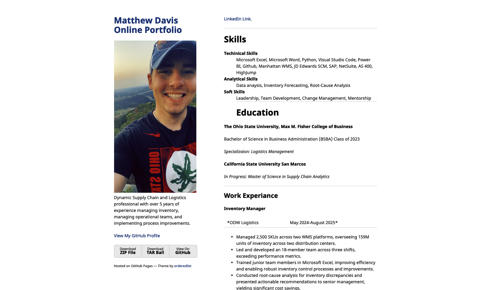

# Guide to E-Portfolio Creation (Milestone 1)

## Introduction

This tutorial serves as a guide on how I created my professional e-portfolio on **GitHub Pages**, detailing every step from initial repository creation to the final theme customization submitted for Milestone 1. I used the **Jekyll Minimal theme** for its simplicity, enabling me to focus on content.

---

# Step-by-Step Guide
I was given the following deliverables for an assignment in one of my classes: 
## Creating GitHub Pages

The foundation of my e-portfolio is a **GitHub Pages** site, which is hosted directly from my repository.

1.  **Repository Naming:** I created a new public repository on GitHub named `mattdavis225.github.io`, which automatically sets it up as a GitHub Pages site.
2.  **Theme Selection:** I initially applied the Jekyll Minimal theme to this repository. Here is a link to the site: 

## Cloning The Repository

To customize the theme and add my content locally, I used Git to clone the repository to my desktop.

1.  **Local Clone:** I used **Visual Studio Code (VSCode)** to clone the repository, which created a local working copy of all the theme files.
2.  **Initial Commit:** This allowed me to start modifying files like `_config.yml` and `index.md` using VSCode's built-in tools.

## Configuring the Theme

Theme configuration is managed primarily through the `_config.yml` file and custom SCSS.

### Configuring the Theme

1.  **Adding Metadata:** I updated the `_config.yml` file to include my name, professional description, and logo path:
    ```yaml
    title: Matthew Davis Online Portfolio
    logo: /assets/img/logo.JPG
    description: Dynamic Supply Chain and Logistics professional...
    ```
2.  **Custom Styling:** I customized the theme's appearance (e.g., changing the font and link colors) by directly editing the SCSS files in the `_sass` directory.
3.  **Using Preview:** I relied heavily on the **VSCode Markdown Preview** feature to instantly see how my `index.md` content looked while I was writing it.


### Final Configuration

1.  **Content Creation:** I populated the root `index.md` file with all my professional details, including **Skills**, **Education**, and **Work Experience** using standard Markdown headers and lists.
2.  **Linking Resources:** Appropriate links to templates or resources I used were included in the portfolio itself.

---

## Final screenshot of My portfolio

Below is a screenshot of the final e-portfolio as it appeared after successfully completing Milestone 1. The image on the right shows the full live page, and the image below that confirms the correct URL for my GitHub Pages site.

### Final Live Page



### Live URL Confirmation


## Link to minimal Theme Template (URL)

The template for this e-portfolio is based on the Minimal theme:
[Jekyll Minimal Theme Repository](https://github.com/pages-themes/minimal)